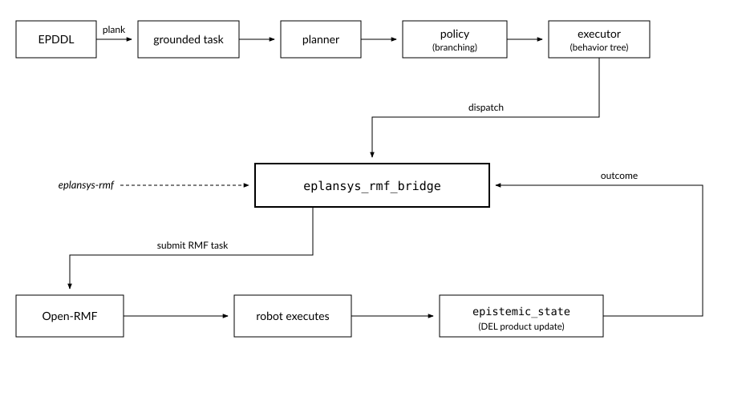

Open-RMF execution
==================

``eplansys_rmf_bridge`` runs an epistemic policy on a robot fleet managed by
`Open-RMF <https://github.com/open-rmf>`_. It is an ``ActionExecutorClient``:
it accepts a dispatched action, submits the corresponding RMF task, waits for
completion, and calls ``finish()`` with the outcome the robot observed.
``plansys2_msgs/ActionExecution`` carries an ``outcome`` field for this, and
the policy branches on it.

The bridge is maintained in its own repository,
`eplansys-rmf <https://github.com/ePlanSys/eplansys-rmf>`_. Open-RMF is a
substantial dependency, and requiring it from ``eplansys`` would render the
planning stack unusable for installations that do not operate a fleet. This is
the arrangement ``plansys2_aletheia_plan_solver`` already uses for its external
binary.

         executor dispatches an action to eplansys_rmf_bridge, which submits an
         RMF task; the robot executes it and the observation returns as an
         outcome that updates the epistemic state.

   Where the bridge sits between the policy and the fleet

The loop closes at the bridge: it is the only component that both dispatches
into the fleet and receives what the fleet observed. Everything above it is the
planner's, everything below it is Open-RMF's, and the ``outcome`` edge is the
one that makes the execution epistemic rather than a remote control.

Division of responsibility
--------------------------

The two systems decide disjoint things. Open-RMF holds no representation of
knowledge, and ePlanSys holds no representation of shared physical resources.

.. list-table::
   :header-rows: 1
   :widths: 22 78

   * - System
     - Determines
   * - ePlanSys
     - what has to be found out, which agent should act, and which agents may
       come to know the result
   * - Open-RMF
     - the allocation of floor space, lifts and doors, and which robot is
       available to perform the work

What a performer does
---------------------

The process reads its task map and turns every action name in it into one
performer. What that performer does when the executor dispatches it depends on
the entry:

* An action that moves a robot submits an RMF task pinned to the robot its
  agent is bound to, waits for the fleet to report it done, and finishes.
* An action marked ``local`` is a speech act. RMF has no representation of
  saying things and no robot moves to say them, so nothing is submitted and the
  performer completes after its stated duration. The epistemic effect is
  entirely the planner's.
* An action marked ``sensing`` finishes with an outcome token. This is the
  argument the policy branches on, and the only reason the bridge is more than
  a remote control.

Reference scenario
------------------

The survey domain: three robots and a site that may be contaminated, under a
goal of three conjuncts. The scout is required to find out whether the site is
contaminated, the relay to come to know the result, and an observer not to. The
planner declines to broadcast and uses a private channel instead, since
broadcasting would falsify the third conjunct. Executing it over an RMF fleet,
with RMF driving the robots, is the intended demonstration of the bridge, and
is described in :doc:`demo`.

.. toctree::
   :maxdepth: 1

   decisions
   task_map
   demo
   warehouse
   diagnostics
   building
