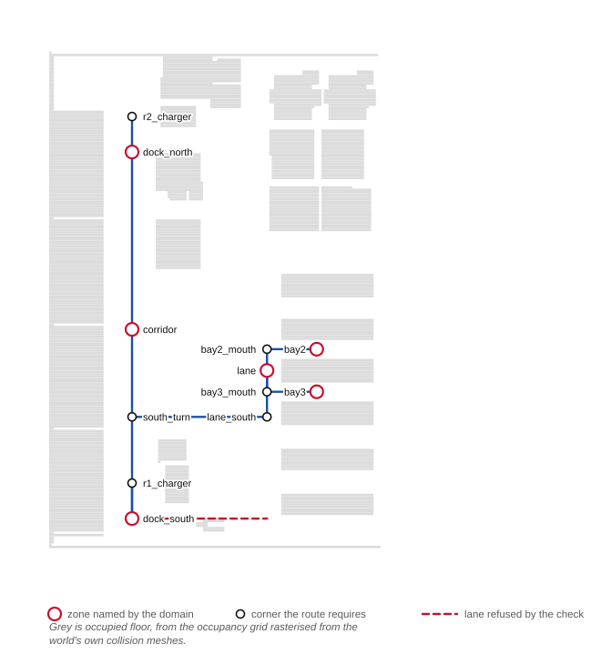
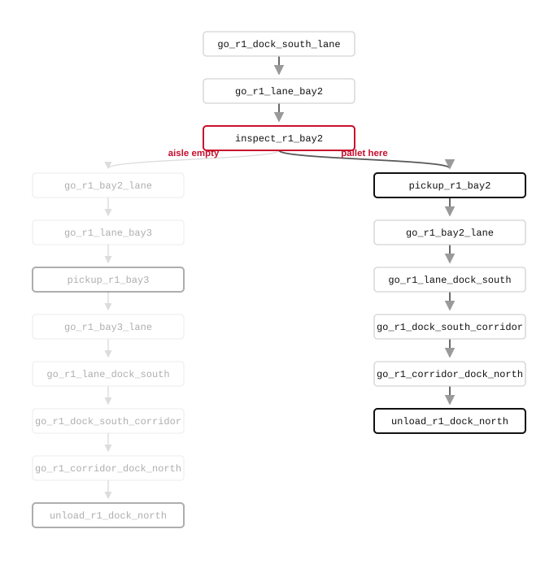
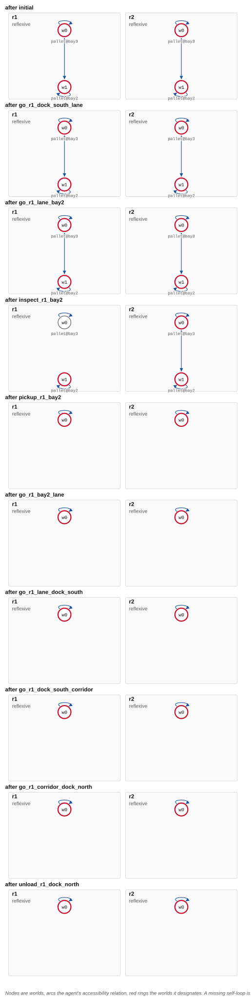
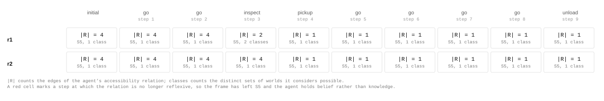
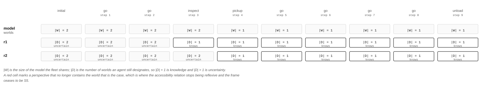

A warehouse run, end to end
===========================

The office survey in :doc:`demo` is the smallest thing the bridge can drive. This
is a larger one: two robots in an AWS warehouse, a pallet that may be in either
of two bays, and a policy that inspects before it commits.

It is worth reading because every field of the task map that the survey leaves
at its default is exercised here, and because the run shows what the epistemic
state is actually doing while Open-RMF moves the robot.

``warehouse_rmf_demo`` lives in the
`Epistemic-Robotics <https://github.com/HanielUlises/Epistemic-Robotics>`_
repository, under ``ros2_ws/src``, alongside a hotel scenario built the same
way. Only the bridge it launches is documented here.

The floor
---------

Open-RMF drives robots over a nav graph, and the domain names zones. The two
vocabularies have to agree, so the graph is generated from the same source the
domain is written against and checked against the occupancy grid.

         domain are ringed; intermediate corners carry the route; one lane is
         refused because it crosses occupied floor.

   The nav graph over the occupancy grid, with one lane refused by the check

Not every vertex is a zone. ``dock_south``, ``corridor``, ``dock_north``,
``lane``, ``bay2`` and ``bay3`` are named by the domain; ``bay2_mouth``,
``south_turn`` and the chargers exist because a route needs a corner to turn at.
A lane that crosses occupied floor is refused rather than drawn, which is the
check that keeps the graph and the world in agreement.

The map
-------

The survey's map fixes a waypoint per action. This one takes the destination
from the action's own arguments, which is what lets a handful of entries cover
a domain that names zones in its actions:

.. code-block:: json

   {
     "zones": {
       "dock_south": "dock_south", "corridor": "corridor",
       "dock_north": "dock_north", "lane": "lane",
       "bay2": "bay2", "bay3": "bay3"
     },
     "agents": {
       "r1": {"fleet": "warehouseBot", "robot": "r1"},
       "r2": {"fleet": "warehouseBot", "robot": "r2"}
     },
     "actions": {
       "goto_zone": {"waypoint_arg": 2},
       "look_into": {
         "waypoint_arg": 1,
         "sensing": true,
         "outcome_arg": 1,
         "outcomes": {"bay2": "e-inspect-found", "bay3": "e-inspect-empty"},
         "default_outcome": "e-inspect-empty"
       },
       "pick_up":  {"waypoint_arg": 1},
       "drop_off": {"waypoint_arg": 1},
       "announce": {"local": true, "duration": 4.0}
     }
   }

``goto_zone`` reads its destination from argument 2, so
``(goto_zone r1 lane bay2)`` sends ``r1`` to ``bay2`` without the map naming
either. ``look_into`` is the sensing action, and its ``outcomes`` table is the
simulator's ground truth: inspecting ``bay2`` finds the pallet and inspecting
``bay3`` does not. A fleet whose adapter reports a real observation overrides
all of it, and ``default_outcome`` is what the bridge falls back to with a
warning when nothing reports.

The ``zones`` table is an identity here, since the graph generator already used
the domain's names. It is written out anyway: the two vocabularies agreeing is
a fact worth stating rather than an accident to rely on.

The bridge is launched as an ordinary node, with the map and the port the fleet
adapter is pointed at:

.. code-block:: python

   Node(package='eplansys_rmf_bridge',
        executable='rmf_action_node',
        parameters=[{'task_map': map_file.name,
                     'websocket_port': WEBSOCKET_PORT,
                     'task_timeout': 900.0}])

A 900 second timeout rather than the default 120: a warehouse traverse under
RMF's traffic management takes as long as it takes.

The policy
----------

The planner does not know which bay holds the pallet, so it cannot produce a
sequence. It produces a policy with a branch at the one action that finds out.

         the pallet is present and the case where the aisle is empty, each
         ending in an unload at the north dock.

   One sensing action, two branches, both ending at the north dock

Everything above ``inspect_r1_bay2`` is common. Below it the two arms differ
only in where the pallet is picked up, and both finish by unloading at
``dock_north``. The token the bridge lifts out of the RMF task state is what
selects the arm: ``e-inspect-found`` takes the right, ``e-inspect-empty`` sends
the robot on to ``bay3``.

What the model does while the robot drives
------------------------------------------

The epistemic state applies a product update after every action, whether or not
that action told it anything new. Most actions do not.

         drive actions and collapse to one at the inspect, after which both
         robots consider a single world possible.

   The model after each action, for both robots

Two worlds survive every ``go`` action: driving somewhere tells nobody where the
pallet is. The collapse happens at ``inspect_r1_bay2`` and nowhere else, and it
is asymmetric, since ``r1`` looks and ``r2`` does not. That asymmetry is the
thing a classical planner has no way to represent, and it is why the outcome has
to travel back from the fleet rather than being assumed.

         at each step, for both robots.

   The accessibility relation at each step

The table is the same run counted rather than drawn. ``|R|`` is the size of the
agent's accessibility relation and the classes column is how many distinct sets
of worlds it still considers possible. A frame that stops being reflexive has
left S5, and the agent holds belief rather than knowledge from that point on,
which is a thing to notice rather than a thing to allow by accident.

The trajectory
--------------

   What the robot actually drove

RMF moved the robot; the policy only said where to go next. Traffic management,
the lanes and the door and lift negotiation are all Open-RMF's, and the bridge
forgoes none of it. What it takes back is the allocation, so that the agent the
model credits with knowing is the robot that actually looked.
